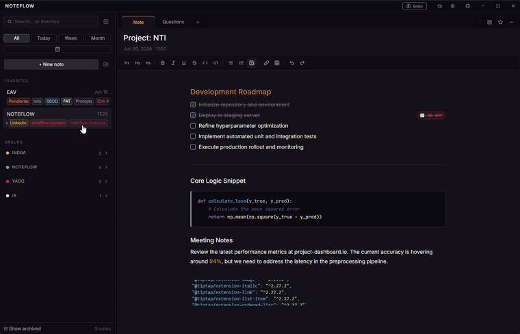

<div align="center">
  

  # NoteFlow

  **Fast notes for Windows, Linux & macOS developers.**
  *Local files, optional private GitHub sync. No telemetry. Just you and your thoughts.*

  [](https://github.com/yagoid/noteflow/releases/latest)
  [](LICENSE)

</div>

---

## What is NoteFlow?

NoteFlow is a keyboard-first, lightweight note-taking application for **Windows, Linux** (including Arch-based distributions like CachyOS) **and macOS** (Apple Silicon).

Built specifically for software engineers and power users who need something faster than Notion and less clunky than the built-in OS alternatives. Scratch down a task list, jot code snippets, or capture a quick thought — and optionally access all of it from a terminal or headless server.

## Features

- **Markdown-first editor** — headings, bold, italic, inline code, code blocks, and interactive task lists with checkboxes.
- **Floating sticky notes** — launch any note as an independent floating window that stays on top while you work.
- **Note groups & deadlines** — organize notes into color-coded groups and attach due dates to any task.
- **Encrypted notes** — lock individual notes with a password; stored as ciphertext, no master key, no backdoor.
- **Private GitHub sync** — connect via Device Flow OAuth (no personal access tokens) and sync to a private repo you control. No third-party cloud, no telemetry.
- **Headless CLI** — a zero-dependency Node.js companion CLI that reads/writes the same notes directory. Works over SSH, on Raspberry Pi, in cron jobs, and with AI agents.
- **4 built-in themes** — Carbon, Midnight Blue, Tokyo Night, Arctic Day — with JetBrains Mono and minimal chrome.

## Download

Get the latest release from the [Releases page](https://github.com/yagoid/noteflow/releases/latest).

- **Windows**: `NoteFlow-X.Y.Z-Setup.exe`
- **macOS (Apple Silicon)**: `NoteFlow-X.Y.Z-arm64.dmg`
- **Debian/Ubuntu/Mint**: `noteflow_X.Y.Z_amd64.deb`
- **Arch/CachyOS/Manjaro**: `noteflow-X.Y.Z-x86_64.pkg.tar.zst`
- **Universal Linux**: `NoteFlow-X.Y.Z-x86_64.AppImage` (works on any distro)

### macOS Installation

Open `NoteFlow-X.Y.Z-arm64.dmg` and drag **NoteFlow** to your Applications folder.

This build is **not signed with an Apple Developer ID** (NoteFlow is a free, source-available project), so on first launch macOS Gatekeeper will say the app "cannot be opened because Apple cannot check it for malicious software." This is expected — to open it once:

- **Right-click** (or Control-click) the NoteFlow app → **Open** → **Open** in the dialog.

If that doesn't work, clear the quarantine flag from a terminal:

```bash
xattr -dr com.apple.quarantine /Applications/NoteFlow.app
```

> Apple Silicon only (M1 and newer). Intel Macs are not currently supported.

#### CLI on macOS (optional)

The companion `noteflow` CLI ships inside the app bundle. To put it on your `PATH`:

```bash
ln -sf /Applications/NoteFlow.app/Contents/Resources/cli/noteflow.js /usr/local/bin/noteflow
chmod +x /Applications/NoteFlow.app/Contents/Resources/cli/noteflow.js
```

### Arch/CachyOS Installation

#### Using the prebuilt package:
```bash
# Install the prebuilt pacman package
wget https://github.com/yagoid/noteflow/releases/latest/download/noteflow-1.5.6-x86_64.pkg.tar.zst
sudo pacman -U noteflow-1.5.6-x86_64.pkg.tar.zst
```

#### Using the AppImage (universal):
```bash
wget https://github.com/yagoid/noteflow/releases/latest/download/NoteFlow-1.5.6-x86_64.AppImage
chmod +x NoteFlow-1.5.6-x86_64.AppImage
./NoteFlow-1.5.6-x86_64.AppImage
```

#### From AUR (if available):
```bash
paru -y noteflow    # using paru
# or
yay -S noteflow     # using yay
```

*[Landing page](https://yagoid.github.io/noteflow/) · [CLI reference](https://yagoid.github.io/noteflow/cli.html)*

## CLI

A standalone CLI ships with every install and is also available for headless systems:

```bash
# Headless install (Linux / Raspberry Pi)
curl -fsSL https://raw.githubusercontent.com/yagoid/noteflow/main/cli/install-cli.sh | sudo bash

# Usage
noteflow add "fix CORS bug" --tag urgent
noteflow list --group backend --json
noteflow push
```

Full reference → [`cli/noteflow-cli/SKILL.md`](cli/noteflow-cli/SKILL.md) or [cli.html](https://yagoid.github.io/noteflow/cli.html)

### AI Agent Skill

Install the NoteFlow skill in your AI agent (Claude Code, Cursor, etc.) to interact with your notes from any conversation:

```bash
npx skills add yagoid/noteflow/cli/noteflow-cli
```

## Development

```bash
git clone https://github.com/yagoid/noteflow.git
cd noteflow
npm install
npm run dev
```

To build the installers:

```bash
npm run dist
# Generates for Windows: NoteFlow-X.Y.Z-Setup.exe
# Generates for Linux:
#   - noteflow_X.Y.Z_amd64.deb (Debian/Ubuntu/Mint)
#   - NoteFlow-X.Y.Z-x86_64.AppImage (Universal Linux)
#   - noteflow-X.Y.Z-x86_64.pkg.tar.zst (Arch/CachyOS)
# Generates for macOS (only when run on an Apple Silicon Mac):
#   - NoteFlow-X.Y.Z-arm64.dmg
```

## License

[GNU General Public License v3.0 or later](LICENSE) (`GPL-3.0-or-later`).

NoteFlow is free software: you can use, study, share, and modify it freely. Any
distributed derivative work must also be released under the GPL-3.0 (or a later
version), keeping the source available under the same copyleft terms.
